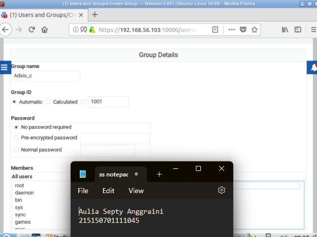
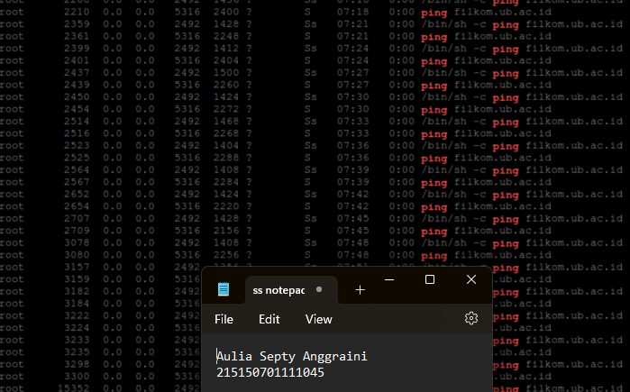

1. Buat direktori dengan nama UAP-Adsis, isi dengan file txt dengan format penamaan catatannya-<nama kamu>.txt, kemudian isi file txt tersebut dengan nama dan NIM kamu. Kemudian atur permission view-only pada file tersebut untuk user biasa. Tunjukkan bukti berupa screenshot yang menunjukkan bahwa file tersebut berhasil diatur permissionnya menjadi view-only untuk user biasa.
    Jawaban : 
    
        -Membuat direktori UAP-Adsis dengan perintah mkdir UAP-Adsis.
    
        -Membuat file catatannya-aulia.txt menggunakan perintah touch catatannya-aulia.txt. Kemudian masuk ke file tersebut dengan menjalankan perintah nano catatannya-aulia.txt
    
        -Memasukan text berupa nama dan NIM saya dalam file catatanya-fingka.txt
    
        -Mengatur permission view-only pada file tersebut untuk user biasa dengan menggunakan perintah sudo chmod 644 catatannya-aulia.txt.
    
        -Mengecek apakah file tersebut sudah berhasil diatur permission nya untuk menjadi view-only untuk user biasa dengan menggunakan perintah ls -l

2. Lakukan konfigurasi alamat IP address sementara pada sistem dan default gateway. (petunjuk 192.168.56 x | x adalah nomor absen)
    Jawaban : 
    
        -Melakukan konfigurasi IP Address sementara dengan menjalankan perintah sudo ifconfig enp0s8 192.168.56.13 netmask 255.255.255.0. Disini saya memasukkan IP Address 192.168.56.13 sesuai dengan nomor absen saya yaitu 13.
    
        -Melakukan verifikasi untuk memastikan alamat IP yang telah dikonfigurasi telah terdaftar dengan menjalankan perintah sudo ifconfig enp0s8.
        
        -Melakukan konfigurasi IP Addres Default Gateway dengan menjalankan perintah sudo route add default gw 192.168.56.13 enp0s8. Disini saya menggunakan IP Addres yang sama dengan perintah sebelumnya. Kemudian saya menjalankan perintah sudo route -n untuk memastikan bahwa alamat IP Default Gateway sudah terdaftar.

3. Lakukan Instalasi Webmin lalu buatlah user nama anda, lalu buat group Adsis_(kelas masing-masing) dan masukkan nama anda di group
    Jawaban : 
    
        -Masuk ke dalam direktori file /etc/apt/source.list kemudian tambahkan deb http://download.webmin.com/download/repository sarge contrib pada baris akhir.
    
        -Menambahkan kunci PGP Webmin agar sistem dapat mempercayai repository baru: wget http://www.webmin.com/jcameron-key.asc 
        -sudo apt-key add jcameron-key.asc
    
        -Menjalankan perintah sudo apt get install webmin untuk menginstall webmin.
    
        -Mengakses webmin dengan menjalankan https://webmin:192.168.56.103:10000. Yang dimana 192.168.56.103 merupakan IP saya yang telah saya cek melalui perintah ifconfig. Dan 10000 adalah port untuk mengakses webmin tersebut.
    
        -Mengakses Users and Group pada webmin untuk membuat user baru.
    
        -Mengakses group dan membuat group baru dengan nama Adsis_c sesuai dengan ketentuan yang ada pada soal. Serta menambahkan user auliasepty yang baru dibuat pada perintah sebelumnya ke dalam group Adsis_e.

4.  Lakukan ping ke alamat ip anda dan coba lakukan reject dan drop di webmin, lalu analisis apa yang terjadi?
    Jawaban : 
    
        -Melakukan ping ke alamat IP saya dengan menjalankan perintah ping 192.68.56.103 -t.
    
        -Mengakses ke network->firewall kemudian ke bagian Incoming packets (INPUT) untuk melakukan reject ping.

5.  Buatlah perintah otomatis yang berfungsi untuk ping www.filkom.ub.ac.id
    Jawaban : 
    
        -Melakukan proses edit pada konfigurasi file cron dengan perintah sudo crontab -e.
    
        -Mengisi konfigurasi crontab dengan perintah */1 * * * * ping filkom.ub.ac.id untuk melakukan ping otomatis setiap menit.
    
        -Memastikan ping berhasil dilakukan dengan menjalankan perintah ps aux | grepping.